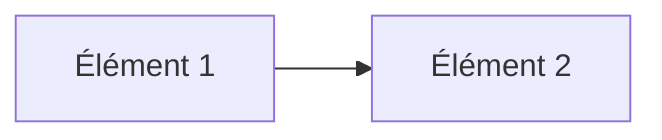

# Jour XX — [Titre du thème]

📅 Date : JJ/MM/AAAA
⏱️ Temps passé : X min
🎯 Charge de travail : Légère / Moyenne / Intense

## 📺 Support suivi
- Vidéo : [timestamp début] → [timestamp fin]
- Lien direct : https://youtu.be/qiQR5rTSshw?t=XXXX

## 🧠 Ce que j'ai appris
<!-- Résume avec tes propres mots, pas de copier-coller. Si tu ne peux pas
     l'expliquer simplement, c'est que ce n'est pas encore acquis. -->

-
-
-

## 🤔 Ce qui a coincé
<!-- Sois honnête ici — c'est la partie la plus utile du dépôt pour toi
     ET pour les autres qui suivront ce challenge. -->

-

## 🛠️ Exercice pratique réalisé
<!-- Décris ce que tu as fait concrètement : commande exécutée, schéma dessiné,
     TP Packet Tracer/GNS3, calcul de subnetting, etc. -->

```
[coller ici commande / config / résultat]
```

## 📊 Schéma (si pertinent)
<!-- GitHub supporte Mermaid nativement, tu peux l'utiliser directement -->



## ✅ Auto-évaluation
- [ ] Je peux expliquer ce concept à voix haute sans notes
- [ ] Je peux l'appliquer dans un cas pratique différent de l'exemple du cours
- [ ] Je vois le lien avec un projet que j'ai déjà fait (thèse, VoIP, cloud...)

## 🔗 Lien avec mes projets précédents
<!-- Optionnel mais valorisant : relie ce jour à ta thèse honeypot,
     ton projet VoIP/Asterisk, ou ton projet cloud Terraform si pertinent -->

-
