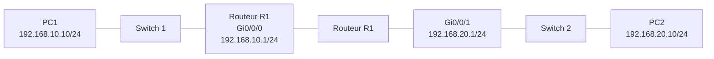

# TP — Interconnexion de deux réseaux via un routeur Cisco (compte-rendu)
 
📅 Date : 16/07/2026
🎯 Outil utilisé : Cisco Packet Tracer
 
## 1. Topologie réalisée
 

 

## 2. Plan d'adressage utilisé
 
| Appareil | Interface | Adresse IP | Masque |
|---|---|---|---|
| PC1 | NIC | 192.168.10.10 | 255.255.255.0 |
| PC1 | Passerelle | 192.168.10.1 | — |
| R1 | Gi0/0/0 (LAN 1) | 192.168.10.1 | 255.255.255.0 |
| R1 | Gi0/0/1 (LAN 2) | 192.168.20.1 | 255.255.255.0 |
| PC2 | NIC | 192.168.20.10 | 255.255.255.0 |
| PC2 | Passerelle | 192.168.20.1 | — |
 
## 3. Résultat — `show ip route`
 
```
192.168.10.0/24 is variably subnetted, 2 subnets, 2 masks
C    192.168.10.0/24 is directly connected, GigabitEthernet0/0/0
L    192.168.10.1/32 is directly connected, GigabitEthernet0/0/0
192.168.20.0/24 is variably subnetted, 2 subnets, 2 masks
C    192.168.20.0/24 is directly connected, GigabitEthernet0/0/1
L    192.168.20.1/32 is directly connected, GigabitEthernet0/0/1
```
 
**Interprétation :**
- Ligne **C (Connected)** : le réseau entier (`/24`) desservi par chaque interface — correspond exactement à la configuration faite (`ip address ... 255.255.255.0`)
- Ligne **L (Local)** : route générée **automatiquement** par IOS pour l'adresse IP exacte de l'interface du routeur elle-même (`/32` = un hôte unique, pas un réseau). Ce n'est pas une erreur de configuration, c'est un comportement natif des versions récentes d'IOS.
## 4. Résultat — pings
 
| Test | Résultat |
|---|---|
| PC1 → 192.168.10.1 (passerelle locale) | ✅ OK |
| PC1 → 192.168.20.1 (interface distante routeur) | ✅ OK |
| PC1 → 192.168.20.10 (PC2, à travers le routeur) | ✅ OK |
| PC2 → 192.168.10.10 (retour vers PC1) | ✅ OK |
 
Tous les pings passent — communication inter-réseaux fonctionnelle.
 
## 5. Réponse à la question clé : pourquoi aucune route statique n'a été nécessaire ?
 
Dès qu'une interface du routeur est configurée avec une IP et activée (`no shutdown`), le routeur considère automatiquement le réseau correspondant comme **directement connecté (`C`)** — il sait l'atteindre sans intermédiaire, simplement parce qu'il possède une interface physique dessus.
 
Le trajet d'un ping PC1 → PC2 :
1. PC1 constate que 192.168.20.10 n'est pas sur son propre réseau → envoie le paquet à sa passerelle (R1, 192.168.10.1)
2. R1 reçoit le paquet sur Gi0/0/0, consulte sa table : le réseau 192.168.20.0/24 est directement connecté sur Gi0/0/1
3. R1 transmet le paquet par Gi0/0/1, qui débouche directement sur le réseau de PC2
4. PC2 reçoit le paquet
Une route statique (`ip route`) ne devient nécessaire que lorsque le réseau de destination **n'est pas directement relié** à une interface du routeur — par exemple un 3ᵉ réseau situé derrière un 2ᵉ routeur. Dans ce cas, il faudrait explicitement indiquer au premier routeur par où passer pour atteindre ce réseau distant.
 
## 6. Prochaine étape
Ajouter un 2ᵉ routeur avec un 3ᵉ réseau non directement connecté à R1, pour observer concrètement la nécessité d'une route statique ou d'un protocole de routage dynamique (OSPF, prévu au Jour 13 du challenge).
