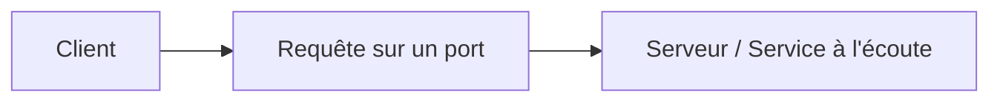

# Jour 2 — Services et applications réseau
 
📅 Date : 07/07/2026
⏱️ Temps passé : ~30 min
🎯 Charge de travail : Légère
 
## 📺 Support suivi
- Vidéo : 0:15:12 → 0:28:17 (Networking Services and Applications, parties 1 et 2)
- Lien direct : https://youtu.be/qiQR5rTSshw?t=912
## 🧠 Ce que j'ai appris
<!-- Résume avec tes propres mots -->
-
-
-
## 🤔 Ce qui a coincé
-
## 🛠️ Exercice pratique réalisé
Liste de 10 protocoles + leur port par cœur (sans notes) :
 
| Protocole | Port | Usage |
|---|---|---|
| HTTP | | |
| HTTPS | | |
| FTP | | |
| SSH | | |
| Telnet | | |
| SMTP | | |
| DNS | | |
| DHCP | | |
| POP3 | | |
| IMAP | | |
 
## 📊 Schéma (si pertinent)

 
## ✅ Auto-évaluation
- [ ] Je peux expliquer ce concept à voix haute sans notes
- [ ] Je peux l'appliquer dans un cas pratique différent de l'exemple du cours
- [ ] Je vois le lien avec un projet que j'ai déjà fait (thèse, VoIP, cloud...)
## 🔗 Lien avec mes projets précédents
- Dans mon projet Asterisk, le port SIP utilisé était...
- Dans ma thèse honeypot, Cowrie écoute sur les ports...
