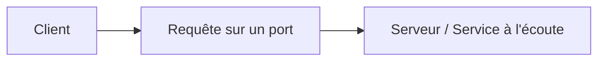

# Jour 2 — Services et applications réseau
 
📅 Date : 07/07/2026
⏱️ Temps passé : ~30 min
🎯 Charge de travail : Légère
 
## 📺 Support suivi
- Vidéo : 0:15:12 → 0:28:17 (Networking Services and Applications, parties 1 et 2)
- Lien direct : https://youtu.be/qiQR5rTSshw?t=912
## 🧠 Ce que j'ai appris
<!-- Résume avec tes propres mots -->
- Les types de VPN
- Les protocoles IPsec pour asurer la sécurité les services VPN
- Les services d'accès réseaux 
## 🤔 Ce qui a coincé
- IPsec n'est pas un protocole mais un ensemble de protocole appelé IPsec
## 🛠️ Exercice pratique réalisé
Liste de 10 protocoles + leur port par cœur (sans notes) :
 
| Protocole | Port | Usage |
|---|---|---|
| HTTP |80 |Connexion web no sécurisée |
| HTTPS |443 |Connexion web sécurisée avec cryptage |
| FTP |21 |Transfert de fichier |
| SSH |22 |Accès distant sécurisé |
| Telnet |23 |Accès distant non sécurisé |
| SMTP |25 |Utilisé pour l'envoie de Mail |
| DNS |53 |Transforme les noms de domaines en IP |
| DHCP |67 |Pour distribuer automatiquement des adresses IP |
| POP3 |110/995 |Permet de recupérer les email depuis un serveur vers un client |
| IMAP |143/993 |Consulter les emails depuis un serveur |
 
## 📊 Schéma (si pertinent)

 
## ✅ Auto-évaluation
- [✅ ] Je peux expliquer ce concept à voix haute sans notes
- [✅ ] Je peux l'appliquer dans un cas pratique différent de l'exemple du cours
- [✅ ] Je vois le lien avec un projet que j'ai déjà fait (thèse, VoIP, cloud...)
## 🔗 Lien avec mes projets précédents
- Dans mon projet Asterisk, le port SIP utilisé était...
- Dans ma thèse honeypot, Cowrie écoute sur les ports...
