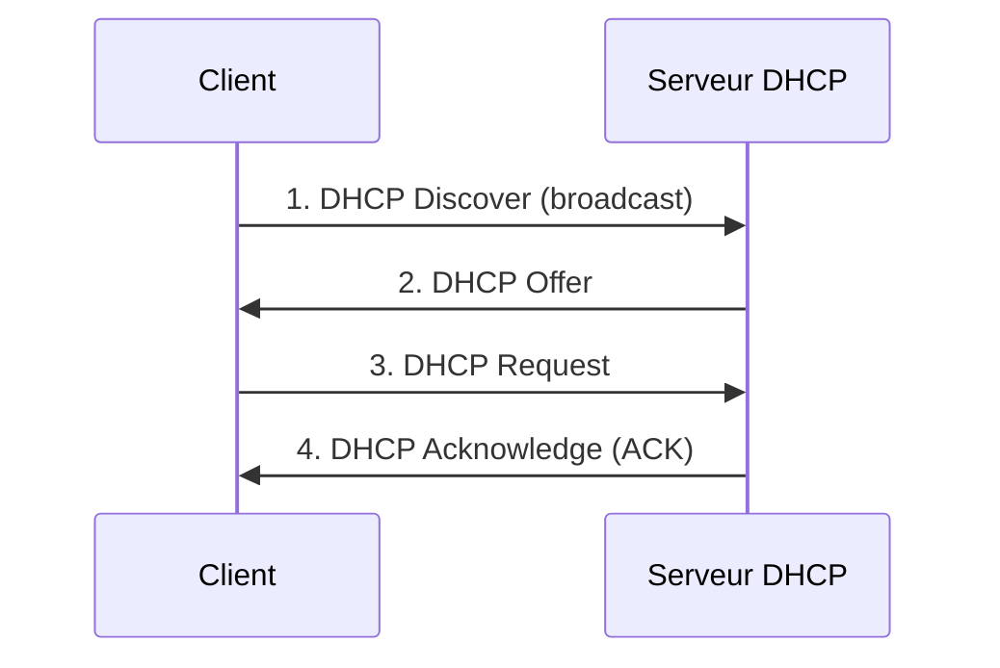

# Jour 3 — DHCP
 
📅 Date : 08/07/2026
⏱️ Temps passé : ~40 min
🎯 Charge de travail : Moyenne
 
## 📺 Support suivi
- Vidéo : 0:28:17 → 0:38:03 (DHCP)
- Lien direct : https://youtu.be/qiQR5rTSshw?t=1697
## 🧠 Ce que j'ai appris
<!-- Résume avec tes propres mots -->
- Les adresses IP statiques et les dynamiques (DHCP: Dynamic Host configuration Protocol)
- Les fonctionnement DORA du DHCP(Discover - Offer - Request - Acknowlegment)
- Le bail, la réservation d'IP, les Ports (67/68), plage d'adresse etc
## 🤔 Ce qui a coincé
- Pratique tous a étét compris
## 🛠️ Exercice pratique réalisé
Schéma du processus DORA (Discover - Offer - Request - Acknowledge), fait de mémoire :
 

 
Notes sur chaque étape :
1. Discover : La machine cliente lance un paquet DHCP discovery pour demander une adresse IP au serveur (Port 67)
2. Offer : Le serveur répond avec DES offres d'IP avec paramètres réseaux (DHCP offer) sur le port 68/UDP
3. Request : La machine client répond en choisit une offre
4. Acknowledge : Le serveur valide et confirme cette offre pour le client
NB: Tous ces messages sont en mode broadcast
## ✅ Auto-évaluation
- [✅] Je peux expliquer ce concept à voix haute sans notes
- [✅] Je peux l'appliquer dans un cas pratique différent de l'exemple du cours
- [✅] Je vois le lien avec un projet que j'ai déjà fait (thèse, VoIP, cloud...)
## 🔗 Lien avec mes projets précédents
- Dans mon architecture VMware (thèse honeypot), le DHCP était géré par...
- Différence entre un bail DHCP et une réservation DHCP dans mon contexte :
