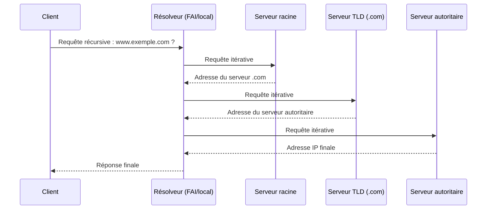

# Jour 4 — DNS
 
📅 Date : À COMPLÉTER
⏱️ Temps passé : ~35 min
🎯 Charge de travail : Moyenne
 
## 📺 Support suivi
- Vidéo : 0:38:03 → 0:46:01 (DNS)
- Lien direct : https://youtu.be/qiQR5rTSshw?t=2283
## 🧠 Ce que j'ai appris
<!-- Résume avec tes propres mots -->
-
-
-
## 🤔 Ce qui a coincé
-
## 🛠️ Exercice pratique réalisé
Requêtes DNS réelles avec `nslookup` ou `dig` sur 3 domaines, puis interprétation du résultat :
 
```bash
nslookup google.com
nslookup github.com
nslookup ucao.sn
```
 
Résultats obtenus (coller ici) :
```
[coller ici la sortie des commandes]
```
 
Interprétation :
-
 
## 📊 Schéma (si pertinent)
Résolution DNS récursive vs itérative :
 

 
## ✅ Auto-évaluation
- [ ] Je peux expliquer ce concept à voix haute sans notes
- [ ] Je peux l'appliquer dans un cas pratique différent de l'exemple du cours
- [ ] Je vois le lien avec un projet que j'ai déjà fait (thèse, VoIP, cloud...)
## 🔗 Lien avec mes projets précédents
- Types d'enregistrements DNS à retenir : A, AAAA, MX, CNAME, PTR, NS, TXT
- Lien avec mon projet Asterisk/VoIP (résolution de noms pour les trunks SIP) :
