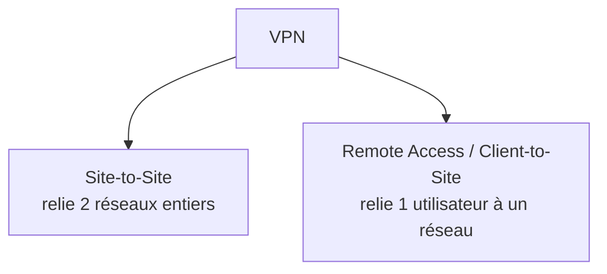

# Jour 6 — Technologies WAN
 
📅 Date : 12/07/2026
⏱️ Temps passé : ~50 min
🎯 Charge de travail : Intense
 
## 📺 Support suivi
- Vidéo : 0:52:52 → 1:22:32 (WAN Technologies, parties 1 à 4)
- Lien direct : https://youtu.be/qiQR5rTSshw?t=3172
## 🧠 Ce que j'ai appris
<!-- Résume avec tes propres mots -->
- Le WAN et le PSTN (ou RTPC: Réseau Téléphonique Public Commuté)
- Le leased Line, le ISDN et xDSL (SDSL, ADSL, VDSL)
- Commutation de Paquet et Communtation de circuit
## 🤔 Ce qui a coincé
- Tous a été dure à comprendre c'est pourquoi prendre son temps 
## 🛠️ Exercice pratique réalisé
Comparatif des technologies WAN vues dans la vidéo :
 
| Technologie | Avantages | Inconvénients | Cas d'usage typique |
| --- | --- | --- | --- |
| **Ligne louée (Leased Line)** | Bande passante garantie, fiabilité, pas de partage | Très coûteux, surtout sur longue distance | Connexion dédiée entre siège et filiale, VPN d’entreprise |
| **MPLS** | Qualité de service (QoS), flexibilité, VPN sécurisé | Dépend du fournisseur, configuration complexe | Interconnexion de plusieurs sites, priorisation VoIP/visioconférence |
| **DSL** | Réutilise l’infrastructure téléphonique, accessible | Débit dépend de la distance, sensible aux interférences | Internet domestique (ADSL), petites entreprises (SDSL/VDSL) |
| **Câble coaxial** | Large bande passante, débits élevés, déjà déployé | Bande passante partagée, débit variable | Internet via opérateurs TV câblés en zones urbaines |
| **Fibre optique** | Très haut débit (Gbps), faible latence, fiable | Coût élevé, déploiement progressif | FTTH (Fiber To The Home), backbone opérateurs |
| **Satellite** | Couverture mondiale, utile en zones isolées | Latence élevée, coût important, météo impactante | Connexion Internet en zones rurales ou maritimes |
| **VPN site‑à‑site** | Sécurité logique (chiffrement), interconnexion de sites via Internet | Dépend de la qualité de l’accès Internet, complexité de configuration | Relier plusieurs bureaux distants de manière sécurisée |
## 📊 Schéma (si pertinent)
Types de VPN vus dans la vidéo :
 

 
## ✅ Auto-évaluation
- [✅] Je peux expliquer ce concept à voix haute sans notes
- [✅] Je peux l'appliquer dans un cas pratique différent de l'exemple du cours
- [✅] Je vois le lien avec un projet que j'ai déjà fait (thèse, VoIP, cloud...)
## 🔗 Lien avec mes projets précédents
- Technologie WAN utilisée dans mon projet cloud Terraform (AWS/Azure) :
- Lien avec les trunks IAX2 inter-serveurs de mon projet Asterisk :
