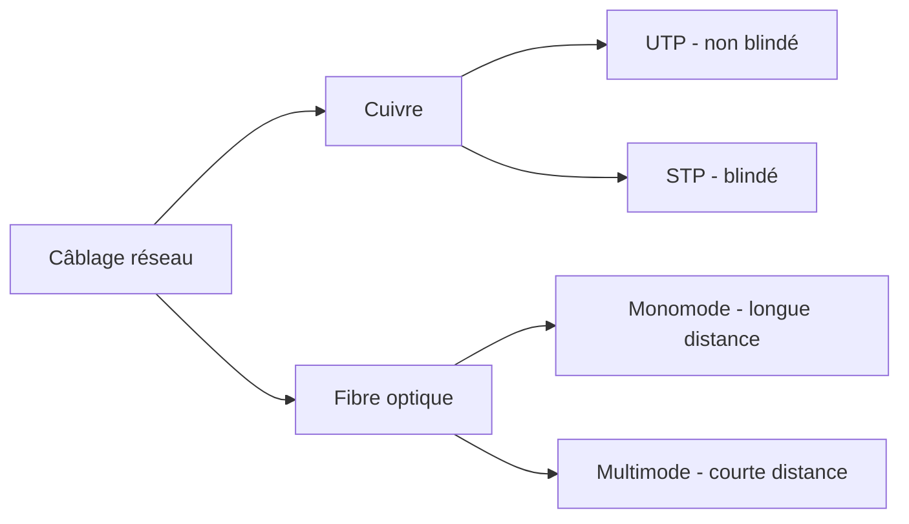

# Jour 8 — Câblage réseau
 
📅 Date : 16/07/2026
⏱️ Temps passé : ~40 min
🎯 Charge de travail : Moyenne
 
## 📺 Support suivi
- Vidéo : 1:22:32 → 1:43:28 (Cabling, parties 1 à 3)
- Lien direct : https://youtu.be/qiQR5rTSshw?t=4952
## 🧠 Ce que j'ai appris
<!-- Résume avec tes propres mots -->
- Les câbles à pairs torsadés (UTP, STP). Pourquoi ils sont torsades (Pour réduire l'EMI (Electromagnetic Interference et la diaphonie (Interference entre fil)))
- Les connecteurs (RJ11, RJ45, & RJ48) et la fibre optique et ses connecteur(SC, LC etc) et les types de fibres (MMF (Multimode Fiber jusqu'à 2km) et le SMF (Single Mode fiber jusqu'à 40 km))
- Les catégories de câbles Ethernet (Cat3, Cat5, Cat5e, Cat6, Cat6a) et leurs différences dus aux débits et à la distances de couverture
## 🤔 Ce qui a coincé
- Durant deux jours d'apprentissage
## 🛠️ Exercice pratique réalisé
Tableau comparatif des câbles cuivre :
 
| Catégorie | Débit max | Distance |
|---|---|---|
| Cat 5e |1Gb/s |100 m |
| Cat 6 |10Gb/s |55 m |
| Cat 6a |10Gb/s |100 m |

 
Fibre optique :
 
| Type | Distance max | Usage typique |
|---|---|---|
| Monomode (Single-mode) |2km |Dans les Campus, Datacenter |
| Multimode |40km |Liaison utilsée par les opérateurs téléphoniques |
 
Connecteurs à identifier : RJ45, LC, SC, ST
- RJ45 est un connecteur à câble Ethernet
- LC, SC, ST sont des connecteurs pour la fibre
## 📊 Schéma (si pertinent)

 
## ✅ Auto-évaluation
- [x] Je peux expliquer ce concept à voix haute sans notes
- [x] Je peux l'appliquer dans un cas pratique différent de l'exemple du cours
- [x] Je vois le lien avec un projet que j'ai déjà fait (thèse, VoIP, cloud...)
## 🔗 Lien avec mes projets précédents
- Type de câblage utilisé (ou qui aurait dû être utilisé) dans mon architecture de thèse :
