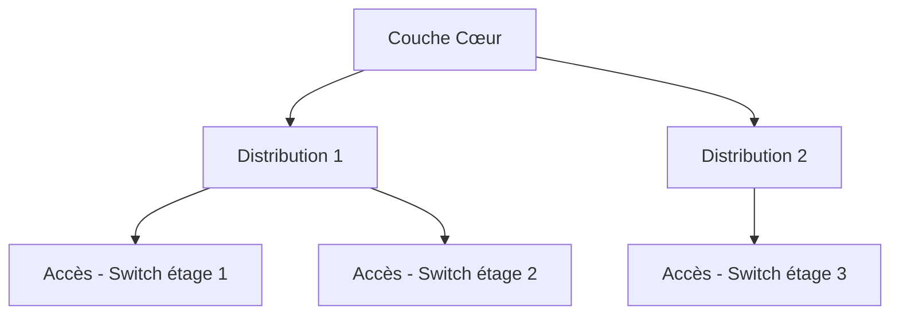

# Jour 9 — Topologies réseau & Implémentations d'infrastructure
 
📅 Date : 17/07/2026
⏱️ Temps passé : ~35 min
🎯 Charge de travail : Moyenne
 
## 📺 Support suivi
- Vidéo : 1:43:28 → 1:56:26 (Topologies + Network Infrastructure Implementations)
- Lien direct : https://youtu.be/qiQR5rTSshw?t=6208
## 🧠 Ce que j'ai appris
<!-- Résume avec tes propres mots -->
- C'est quoi une topologie réseau et la différence entre Topologie physique et Topologie logique
- Les modèles client -> serveur et pair à pair
- Les différents types de topologie
## 🤔 Ce qui a coincé
-  ?
## 🛠️ Exercice pratique réalisé
Tableau des topologies réseau :
 
| Topologie | Description | Avantage principal | Inconvénient principal |
|---|---|---|---|
| Bus |Un seul support physique (câble) relie tout le réseau | |Il presque disparu des réseaux modernes  |
| Étoile (Star) |Tous les appareils du réseau sont relié par un switch ou hub |facile à installer, à dépanner et c'est la topologie la plus utilisées actuellement |Si le switch central tombe en panne, le réseau est affecté |
| Anneau (Ring) |Tous les équipements sont reliè entre eux par le même support ducoup la communication peut être dans un sens unique ou dans les deux sens |Pas trop de collisions comparé à la toplogie en bus |Une rupture de l'anneau peut arrêter le réseau |
| Maillée (Mesh) |Chaque appareil est connecter à tous les autres |Très grande résilience face aux pannes |Très couteux et difficile à entretenir |
 
Apprendre aussi l'architecture 3 tiers (Access | Accès/Distribution/Core | Coeur)
## 📊 Schéma (si pertinent)

 
## ✅ Auto-évaluation
- [x] Je peux expliquer ce concept à voix haute sans notes
- [x] Je peux l'appliquer dans un cas pratique différent de l'exemple du cours
- [x] Je vois le lien avec un projet que j'ai déjà fait (thèse, VoIP, cloud...)
## 🔗 Lien avec mes projets précédents
- Topologie utilisée dans mon architecture de thèse (WAN/DMZ/LAN Management/LAN Interne) :
