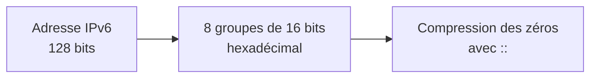

# Jour 11 — IPv6
 
📅 Date : 28/07/2026
⏱️ Temps passé : ~30 min
🎯 Charge de travail : Moyenne
 
## 📺 Support suivi
- Vidéo : 2:15:58 → 2:26:10 (IPv6)
- Lien direct : https://youtu.be/qiQR5rTSshw?t=8158
## 🧠 Ce que j'ai appris
<!-- Résume avec tes propres mots -->
- Pourquoi la création de l'IPv6 et nouveautés par rapport à l'IPv4 (SLAAC (Stateless address autoconfiguration),Entête simplifié et plus besoin de NAT)
- Les types d'adresses IPv6: Link-local, global unicast et unique local ou ULA
- Les règles de compression et simplification d'écriture de l'IPv-
## 🤔 Ce qui a coincé
- Assez simple à comprendre franchement.
## 🛠️ Exercice pratique réalisé
 
### Structure de l'adresse IPv6
- Longueur totale : 128 bits (vs 32 bits pour IPv4)
- Notation : 8 groupes de 16 bits en hexadécimal, séparés par :
### Règles de compression
Compresse ces adresses selon les règles IPv6 (suppression des zéros non significatifs + `::`) :
 
| Adresse complète | Adresse compressée |
|---|---|
| 2001:0db8:0000:0000:0000:0000:0000:0001 |2001:db8::1 |
| fe80:0000:0000:0000:0202:b3ff:fe1e:8329 |fe80::202:b3ff:fe1e:8329 |
| 2001:0db8:0000:0042:0000:0000:0000:0000 |2001:db8:0:42:: |
 
### Types d'adresses IPv6
| Type | Préfixe | Équivalent IPv4 approximatif |
|---|---|---|
| Unicast global |2xxx ou 3xxx |IP publique |
| Link-local |fe80: |IP privé pour la communication en local |
 
## 📊 Schéma (si pertinent)

 
## ✅ Auto-évaluation
- [x] Je peux expliquer ce concept à voix haute sans notes
- [x] Je peux compresser/décompresser une adresse IPv6 manuellement
- [x] Je vois le lien avec un projet que j'ai déjà fait (thèse, VoIP, cloud...)
## 🔗 Lien avec mes projets précédents
- Est-ce que mon architecture de thèse utilise IPv6, et pourquoi (ou pourquoi pas) ?
