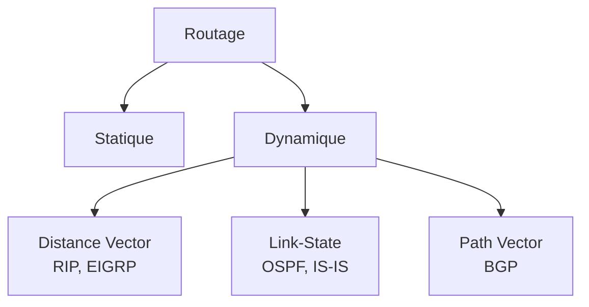

# Jour 13 — Routage : Concepts & Protocoles
 
📅 Date : 30/07/26
⏱️ Temps passé : ~50 min
🎯 Charge de travail : Intense
 
## 📺 Support suivi
- Vidéo : 2:34:06 → 2:59:01 (Routing Concepts parties 1&2 + Routing Protocols)
- Lien direct : https://youtu.be/qiQR5rTSshw?t=9246
## 🧠 Ce que j'ai appris
<!-- Résume avec tes propres mots -->
- Pourquoi le routage et les types de routage (statique et dynamique)
- Les philosophie de routage (Link-State (OSPF), Distance Vector(RIP), Path Vector (BGP))
- Définitions et protocoles de routage (IS-IS, RIP, OSPF,EIGRP et BGP)
## 🤔 Ce qui a coincé
- Comprendre comment les métriques. 
## 🛠️ Exercice pratique réalisé
 
### Routage statique vs dynamique
| | Routage statique | Routage dynamique |
|---|---|---|
| Configuration |Manuelle |Choix du protocole de routage  |
| Adaptation aux pannes |moins adapté |plus adapté (table de routag dynamique) |
| Charge sur le routeur (CPU) |moins lourde |plus lourde |
| Cas d'usage typique |Petit réseau |Réseau de moyen à grand |
 
 
### Tableau des protocoles de routage
| Protocole | Famille         | Utilisation          | Convergence            | Échelle     |
| --------- | --------------- | -------------------- | ---------------------- | ----------- |
| RIP       | Distance Vector | Petits réseaux       | Lente                  | Faible      |
| OSPF      | Link State      | Entreprises          | Rapide                 | Grande      |
| EIGRP     | Hybride         | Réseaux Cisco        | Très rapide            | Grande      |
| IS-IS     | Link State      | Fournisseurs d'accès | Très rapide            | Très grande |
| BGP       | Path Vector     | Internet             | Lente mais très stable | Mondiale    |

 
## 📊 Schéma (si pertinent)

 
## ✅ Auto-évaluation
- [x] Je peux expliquer ce concept à voix haute sans notes
- [x] Je peux configurer une route statique sur un routeur Cisco
- [x] Je vois le lien avec un projet que j'ai déjà fait (thèse, VoIP, cloud...)
## 🔗 Lien avec mes projets précédents
- Type de routage utilisé (ou pertinent) dans mon architecture de thèse (pfSense) :
- Lien avec le TP routage inter-réseaux (routage directement connecté vs statique) :
