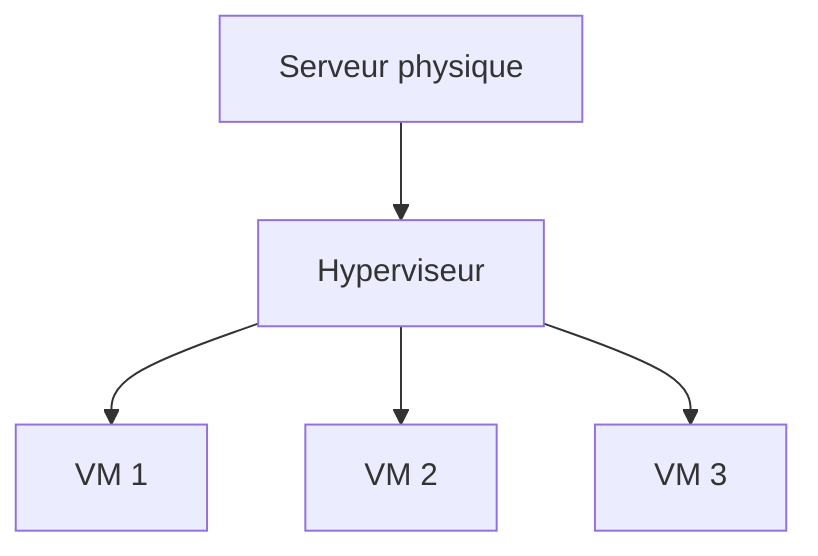

# Jour 15 — Communications unifiées, Virtualisation & SAN
 
📅 Date : 03/08/2026
⏱️ Temps passé : ~35 min
🎯 Charge de travail : Moyenne
 
## 📺 Support suivi
- Vidéo : 2:59:01 → 3:15:33 (Unified Communications + Virtualization + SAN)
- Lien direct : https://youtu.be/qiQR5rTSshw?t=10741
## 🧠 Ce que j'ai appris
<!-- Résume avec tes propres mots -->
- Unified communication (UC Server et UC gateway)
- La virtualisation (but et type (Virtual machine, virtual server et virtual switch, router, fire-wall )) les hyperviseurs (bare-metal = type 1 & type 2)
- Le SDN ET la distinction fonctionnelle entre SAN et NAS
## 🤔 Ce qui a coincé
- C'était des concepts déjà apprisent donc plutôt en classe
## 🛠️ Exercice pratique réalisé
 
### Communications unifiées (VoIP)
- Qu'est-ce que la VoIP, en une phrase : C'est le transport de la voix par paquets IP sur le réseau comme les fichiers.
- Protocoles associés (SIP, RTP...) et leur rôle respectif : SIP permet de commencer et terminer un communication, RTP transporte les données audios en temps réels
### Virtualisation
| Type d'hyperviseur | Fonctionnement | Exemple |
|---|---|---|
| Type 1 (bare-metal) |S'installe directement sur le Hardware |Hyper-V |
| Type 2 (hébergé) |S'installe sur l'OS et fonctionne comme une application |Vmware Workstation |
 
## 📊 Schéma (si pertinent)

 
## ✅ Auto-évaluation
- [ ] Je peux expliquer ce concept à voix haute sans notes
- [ ] Je peux l'appliquer dans un cas pratique différent de l'exemple du cours
- [ ] Je vois le lien avec un projet que j'ai déjà fait (thèse, VoIP, cloud...)
## 🔗 Lien avec mes projets précédents
- Mon architecture de thèse honeypot repose entièrement sur la virtualisation (VMware) — comment ça se relie à ce que j'ai appris aujourd'hui :
- Mon projet Asterisk et le lien avec les communications unifiées 
