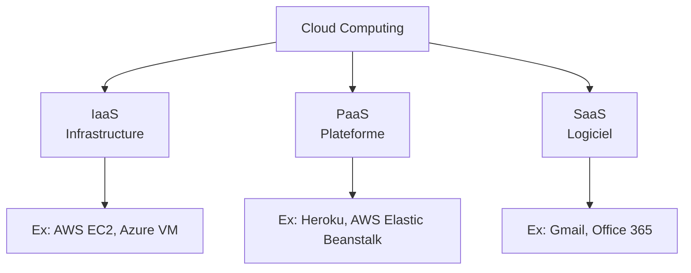

# Jour 16 — Cloud Computing & Implémentation réseau de base
 
📅 Date : 04/08/2026
⏱️ Temps passé : ~35 min
🎯 Charge de travail : Moyenne
 
## 📺 Support suivi
- Vidéo : 3:15:33 → 3:31:02 (Cloud Concepts + Implementing a Basic Network)
- Lien direct : https://youtu.be/qiQR5rTSshw?t=11733
## 🧠 Ce que j'ai appris
<!-- Résume avec tes propres mots -->
- Les concepts fondamentaux du cloud (sa raison d'être et différencier les types de cloud (Privé, Public, Hybride et Communautaire))
- Les modèles de services cloud (IaaS, PaaS et SaaS)
- Savoir quelle exemple de ces modèles cloud
## 🤔 Ce qui a coincé
- Déjà appris en classe
## 🛠️ Exercice pratique réalisé
 
### Modèles de service Cloud
| Modèle | Ce que le fournisseur gère | Ce que le client gère | Exemple |
|---|---|---|---|
| IaaS |Le stockage, infrastruture physique et virtualisation |Choix système d'exploitation, application et données |Amazon EC2 |
| PaaS |Platforme et infrastructure |Le code de ton application |Heroku, Google app Engine |
| SaaS |tout le reste  |Utilisation logiciel |Gmail |
 
### Modèles de déploiement Cloud
| Type | Description | Cas d'usage |
| --- | --- | --- |
| **Public** | Accessible à tous par abonnement, ressources partagées entre plusieurs clients | Hébergement de sites web, applications SaaS, startups qui veulent scaler rapidement |
| **Privé** | Accessible ou réservé à une seule entreprise, infrastructure dédiée | Banque, hôpitaux, institutions gouvernementales (sécurité et conformité élevées) |
| **Hybride** | Combinaison d’un cloud privé et d’un cloud public, interconnectés pour flexibilité | Une entreprise garde ses données sensibles en privé mais utilise le cloud public pour la scalabilité (ex. e‑commerce pendant les pics de ventes) |
| **Communautaire** | Partagé par plusieurs organisations ayant des besoins communs (sécurité, conformité, secteur) | Universités qui mutualisent leurs ressources, organismes de recherche, administrations locales |
### Étapes d'implémentation d'un réseau de base
1.
2.
3.
4.
## 📊 Schéma (si pertinent)

 
## ✅ Auto-évaluation
- [x] Je peux expliquer ce concept à voix haute sans notes
- [x] Je peux l'appliquer dans un cas pratique différent de l'exemple du cours
- [x] Je vois le lien avec un projet que j'ai déjà fait (thèse, VoIP, cloud...)
## 🔗 Lien avec mes projets précédents
- Mon projet cloud Terraform (AWS/Azure) — quel modèle de service ai-je utilisé (IaaS/PaaS/SaaS) ?
- Quel modèle de déploiement (public/privé/hybride) correspond à mon architecture de thèse ?
