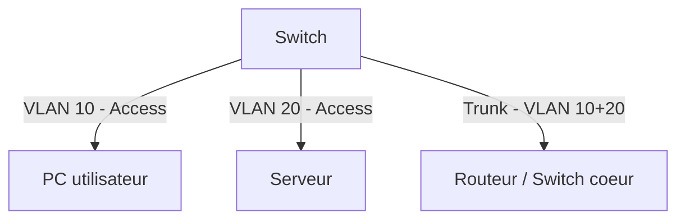

# Jour 18 — Gestion de configuration & Segmentation (VLAN)
 
📅 Date :07/08/2026
⏱️ Temps passé : ~35 min
🎯 Charge de travail : Moyenne
 
## 📺 Support suivi
- Vidéo : 3:55:10 → 4:14:18 (Configuration Management parties 1&2 + Network Segmentation)
- Lien direct : https://youtu.be/qiQR5rTSshw?t=14110
## 🧠 Ce que j'ai appris
<!-- Résume avec tes propres mots -->
- CM (configuration management) et les types de documentations
- L'importances des Back-up et du NAC (Network admission control)
- La segmentation réseau et l'importance des Vlans (sécurité, optimisation performance)
## 🤔 Ce qui a coincé
- BYOD (Bring your own devices) : Quand les entreprises autorisent les employés à emmener leurs propres appareils en entreprise (NAC obligatoire pour admettre les appareils)
## 🛠️ Exercice pratique réalisé
 
### Gestion de configuration
- Différence entre running-config et startup-config sur un équipement Cisco :
Un running-config est la configuration actuelle du mémoire  epeut être modifier en temps réel mais n'est pas conservé au redémarrage de l'équipement. Le startup-config c'est la configuration stockée dans la mémoire non volatile et est sauvegardée au redémarrage de l'équipement
- Pourquoi sauvegarder régulièrement une configuration (backup) ?
Si on veut pas perdre les anciennes configurations
### Segmentation réseau (VLAN)
- Qu'est-ce qu'un VLAN, en une phrase : Un virtual LAN permet de faire un cloisonnement logique, une segmentation du réseau physique en plusieurs réseaux logiques
- Pourquoi segmenter un réseau (sécurité, performance, gestion) : Sécurité renforcée, Perfomances, flexibilité et administration simplifié
- Différence entre un port access et un port trunk sur un switch : Un port access est utilisé par les terminaux (PC, imprimantes...) et est utilisé par un seul Vlan. Un port trunk permet de gérer le trafic de plusieurs Vlans, utilisé pour connecter deux switches ou un switch à un router.
 
## Schéma (si pertinent)

 
## Auto-évaluation
- [x] Je peux expliquer ce concept à voix haute sans notes
- [x] Je peux configurer un VLAN de base sur un switch Cisco
- [x] Je vois le lien avec un projet que j'ai déjà fait (thèse, VoIP, cloud...)
## Lien avec mes projets précédents
- Ma segmentation réseau de thèse était-elle faite par VLAN, par sous-réseau IP, ou les deux ?
