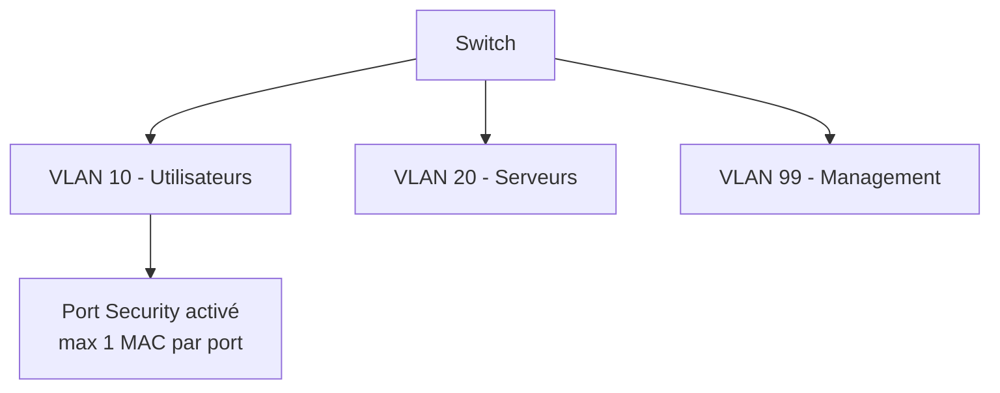

# Jour 19 — Patchs/Mises à jour & Configuration des Switches
 
📅 Date : 11/08/2026
⏱️ Temps passé : ~40 min
🎯 Charge de travail : Moyenne
 
## Support suivi
- Vidéo : 4:14:18 → 4:36:27 (Patches and Updates + Configuring Switches parties 1&2)
- Lien direct : https://youtu.be/qiQR5rTSshw?t=15258
## Ce que j'ai appris
<!-- Résume avec tes propres mots -->
- Maintenance logicielle (c'est quoi un patch, hotfix (correctifs rapides), update et service de package | Upgrade et Downgrade)
- Switch managed et Switch unmanaged
- Spanning Tree Protocol (STP): Empêche les boucles tout en conservant la redondance physique. RSTP plus rapide que le STP
## Ce qui a coincé
- 
## Exercice pratique réalisé
 
### Gestion des patchs
- Différence entre un patch de sécurité et une mise à jour de firmware : Un patch est une mise à jour ou modification ciblé du logiciel pour corriger un problème de sécurité. Une mise à jour apporte en plus corrections de bugs, amélioration de sécurité en générale, améliorations mineure et de petites fonctionnalités 
- Pourquoi tester un patch avant de le déployer en production (fenêtre de maintenance) : Pour vérifier la compatibilité logiciel, validé en environnement de préproduction, disponibilité (en terme de ressources et si l'interruption ou redémarrage est nécessaire)
- Risques de ne pas patcher un équipement (lien avec la vulnérabilité vsftpd 2.3.4 vue en TP pentest) : Une faille de sécurité pouvant être exploitée par les attaquants
 

## Schéma (si pertinent)

 
## Auto-évaluation
- [x] Je peux expliquer ce concept à voix haute sans notes
- [x] Je peux configurer un VLAN + port security sur un switch Cisco
- [x] Je vois le lien avec un projet que j'ai déjà fait (thèse, VoIP, cloud...)
## Lien avec mes projets précédents
- Politique de patch management envisageable pour mon architecture de thèse (pfSense, Wazuh, Suricata) :
