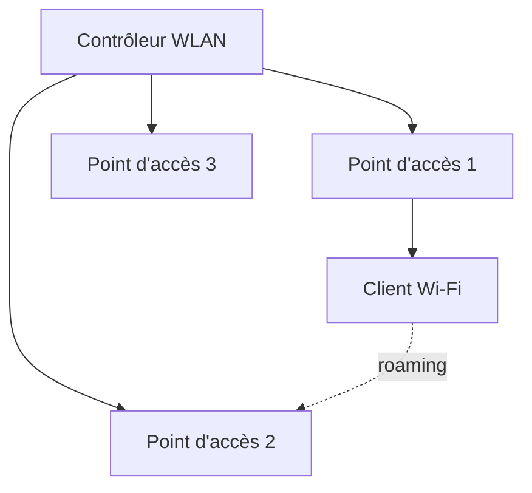

# Jour 20 — Infrastructure WLAN
 
📅 Date : 18/08/2026
⏱️ Temps passé : ~35 min
🎯 Charge de travail : Moyenne
 
## Support suivi
- Vidéo : 4:36:27 → 4:53:17 (Wireless LAN Infrastructure parties 1&2)
- Lien direct : https://youtu.be/qiQR5rTSshw?t=16587
## Ce que j'ai appris
<!-- Résume avec tes propres mots -->
- Les différentes normes des réseaux sans fil ou Wifi
- Les AP et les différentes types (Standalone ou lightweight avec WLC (Wireless LAN Controlller))
-la sécurité des différentes technologie de sécurité
## Ce qui a coincé
-
## Exercice pratique réalisé
 
### Normes Wi-Fi
| Norme | Bande de fréquence | Débit théorique max |
|---|---|---|
| 802.11a |5GHz |54 Mbps |
| 802.11b |2,4GHz |11 Mbps |
| 802.11g |2,4GHz |54 Mbps |
| 802.11n (Wi-Fi 4) |2,4GHz/5GHz |600 Mbps |
| 802.11ac (Wi-Fi 5) |5GHz |plusieurs Gbps |
| 802.11ax (Wi-Fi 6) |2,4GHz/5GHz |9,6 Gbps |
 
### Architecture WLAN
- Différence entre un point d'accès **autonome (standalone)** et un point d'accès **léger (lightweight)** géré par un contrôleur WLAN : Un AP standalone fonctionne de manière relativement indépendante et possédant sa propre configuration. Alors qu'un AP lightweight est conçu généralement pour être gégrer par WLC qui gère la configuration de façon centralisé des AP.
- Rôle du contrôleur WLAN (WLC) : Permet de gérer la configuration des AP de façon centralisée par exemple la configuration des AP, la sécurité, la politqieu d'accès 
- Qu'est-ce que le roaming, et pourquoi est-il important dans un environnement multi-AP : Le roaming est un phénomne qui permet de passer d'un AP à l'autre sans perdre sa connectivité réseau
### Sécurité sans-fil de base
| Protocole | Niveau de sécurité | Utilisable aujourd'hui ? |
|---|---|---|
| WEP |ancien, vulnérable  |pas utiliser |
| WPA |ancien et insuffisant |pas utiliser |
| WPA2 |sécurité plus robuste, pendant longtemps était la norme de sécurité Wifi |Uilisé mais progressivement remplacé |
| WPA3 |génération plus récente de sécurité Wifi |norme actuelle des réseaux sans fil |
 
## Schéma (si pertinent)

 
## Auto-évaluation
- [x] Je peux expliquer ce concept à voix haute sans notes
- [x] Je peux comparer les normes Wi-Fi et choisir la plus adaptée à un scénario donné
- [x] Je vois le lien avec un projet que j'ai déjà fait (thèse, VoIP, cloud...)
## Lien avec mes projets précédents
- Est-ce que le Wi-Fi intervient dans mon architecture de thèse ou mes autres projets, et comment le sécuriserais-je (WPA3, isolation VLAN dédié) ?
 
