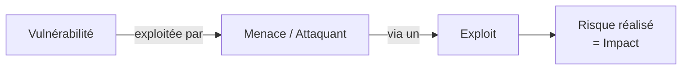

# Jour 22 — Risques, Concepts de Sécurité & Vulnérabilités
 
📅 Date : 20/08/2026
⏱️ Temps passé : ~35 min
🎯 Charge de travail : Moyenne
 
## Support suivi
- Vidéo : 4:53:17 → 5:09:49 (Risk and Security Concepts + Common Network Vulnerabilities)
- Lien direct : https://youtu.be/qiQR5rTSshw?t=17597
## Ce que j'ai appris
<!-- Résume avec tes propres mots -->
- Le plan de reprise d'activité et le plan de continuité d'activité 
- La formation et la sensibilisation des utilisateurs, Pentest des systèmes et scanne de port pour réduire les risques
- Quelques protocoles non-sécurisés (FTP, Telnet, HTTP, TFTP)
## Ce qui a coincé
-
## Exercice pratique réalisé
 
### La triade CIA (Confidentialité, Intégrité, Disponibilité)
| Principe | Définition | Exemple d'atteinte |
|---|---|---|
| Confidentialité |Seules les personnes autorisées ont accès aux informations | |
| Intégrité |Les données ne doivent pas être altérer par une entité non-autorisés | |
| Disponibilité |L'accès aux données doit être immédiate pour les personnes autorisées | |
 
### Vocabulaire du risque
- Différence entre **vulnérabilité**, **menace (threat)** et **risque** :  La vulnérabilité est une faille qui peut-être exploiter pour nuire. Il peut être un défaut de configuration, un port ouvert, des systèmes obsolète. Une menace est un  acteur qui peut exploiter cette vulnérabilité. On est les appelle Hacker mais aujourd'hui avec l'émergence de L'IA il existe des bots sur internet qui le scanne à la recherche de vulnérabilité. Le risque c'est la probabilité qu'une menace exploite une vulnérabilité avec un impact (perte d'argent, arrêt de service, perte de données etc.)
- Qu'est-ce qu'un **exploit** ? Tout manoeuvre permettant de tirer parti d'une vulnérabilité dans un logiciel, système ou protocol pour obtenir un comportement non prévu par le concepeteur.
- Différence entre une vulnérabilité **zero-day** et une vulnérabilité connue (comme vsftpd 2.3.4 de ton TP pentest) : Une vulnérabilité zéro-day est une vulnérabilité inconnu même du fabriquant. C'est pourquoi zéro-day pour zéro jour de correction.  Une vulnérabilité connue est une faille déjà publiée, souvent avec un identifiant CVE et un correctif disponible mais pas appliqué

 
## Schéma (si pertinent)

 
## Auto-évaluation
- [x] Je peux expliquer ce concept à voix haute sans notes
- [x] Je peux appliquer la triade CIA à un cas concret différent de l'exemple du cours
- [x] Je vois le lien avec un projet que j'ai déjà fait (thèse, VoIP, cloud...)
## Lien avec mes projets précédents
- Applique la triade CIA à ton architecture de thèse honeypot : quel élément protège la confidentialité, l'intégrité, la disponibilité ?
- Reclasse la vulnérabilité vsftpd 2.3.4 (TP pentest) selon le tableau des vulnérabilités courantes ci-dessus :
